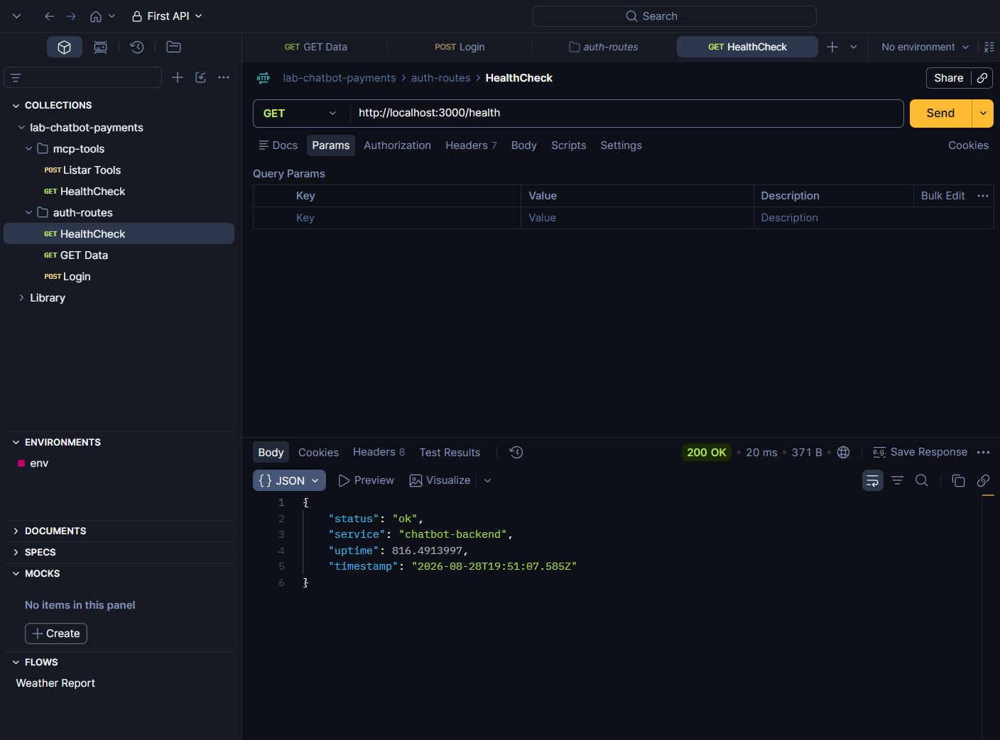
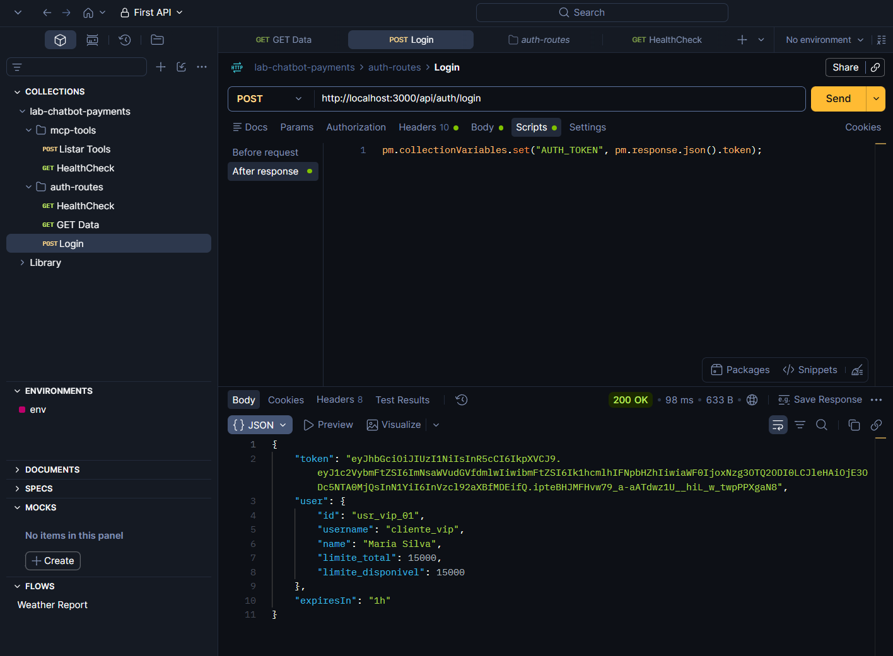
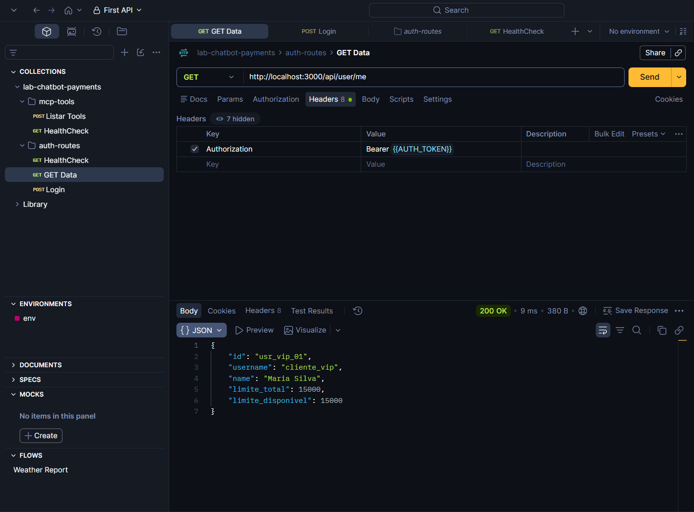

# API Backend Orquestradora (backend)

## 1. Visao Geral
Modulo responsavel pela API Backend do assistente de pagamentos. Gerencia o fluxo de autenticacao de usuarios, controle e consulta de limites de credito em memoria, conexao com o modelo LLM local (Ollama) e integracao como cliente MCP com o servidor `mcp-tools`.

- **Porta padrao:** `3000`
- **Endpoint healthcheck:** `GET http://localhost:3000/health`
- **Endpoints de autenticacao:** `POST http://localhost:3000/api/auth/login` e `GET http://localhost:3000/api/user/me`
- **Responsavel:** Álvaro Kayc

---

## 2. Requisitos Cumpridos

### 2.1 Seguranca e Autenticacao (`src/auth/`)
1. **Hashing Seguro de Senhas (`password.ts`)**
   - Hashing com algoritmo `scrypt` utilizando salt criptografico aleatorio de 16 bytes via `node:crypto`.
   - Verificacao de credenciais com comparacao `timingSafeEqual` para protecao contra ataques de temporizacao (*timing attacks*).
2. **Tokens de Acesso JWT (`jwt.ts`)**
   - Emissao de tokens assinados com algoritmo `HS256`.
   - Tempo de expiracao de 1 hora (`JWT_EXPIRES_IN=1h`), conforme especificado no workshop.
   - Retorno estruturado contendo `{ token, user, expiresIn: "1h" }`.
3. **Protecao de Rotas (`middleware.ts`)**
   - Middleware `requireAuth` que intercepta o cabecalho `Authorization: Bearer <token>`, valida a assinatura e decodifica o usuario para `req.user`.

### 2.2 Base de Usuarios e Limites em Memoria (`users.ts`)
Perfis de teste configurados com senhas hasheadas e controle de limite disponivel:

| Username | Senha | Nome Completo | Limite Inicial | Finalidade do Teste |
|---|---|---|---|---|
| `cliente_vip` | `123` | Maria Silva | **R$ 15.000,00** | Teste de compras de alto valor |
| `cliente_padrao` | `123` | João Souza | **R$ 2.000,00** | Fluxo padrao de compras (PIX e Cartao) |
| `cliente_sem_saldo` | `123` | Carlos Lima | **R$ 100,00** | Validacao de recusa por `LIMITE_EXCEDIDO` |

---

## 3. Execucao e Testes

### 3.1 Instalacao e Inicializacao
```bash
# Instalar dependencias
npm install

# Executar suite de testes unitarios de autenticacao
npm run test:auth

# Iniciar o servidor backend em modo watch na porta 3000
npm run dev
```

### 3.2 Validacao via Postman / HTTP

#### Requisicao 1: Healthcheck (`GET /health`)
- **Metodo:** `GET`
- **URL:** `http://localhost:3000/health`
- **Resposta Esperada (200 OK):**
```json
{
  "status": "ok",
  "service": "chatbot-backend",
  "uptime": 12.5,
  "timestamp": "2026-08-28T16:00:00.000Z"
}
```

#### Requisicao 2: Login de Usuario (`POST /api/auth/login`)
- **Metodo:** `POST`
- **URL:** `http://localhost:3000/api/auth/login`
- **Headers:**
  - `Content-Type: application/json`
- **Body:**
```json
{
  "username": "cliente_padrao",
  "password": "123"
}
```
- **Resposta Esperada (200 OK):**
```json
{
  "token": "eyJhbGciOiJIUzI1NiIsInR5cCI6IkpXVCJ9...",
  "user": {
    "id": "usr_std_02",
    "username": "cliente_padrao",
    "name": "João Souza",
    "limite_total": 2000,
    "limite_disponivel": 2000
  },
  "expiresIn": "1h"
}
```

#### Requisicao 3: Consulta de Perfil e Saldo (`GET /api/user/me`)
- **Metodo:** `GET`
- **URL:** `http://localhost:3000/api/user/me`
- **Headers:**
  - `Authorization: Bearer <seu_token_jwt>`
- **Resposta Esperada (200 OK):**
```json
{
  "id": "usr_std_02",
  "username": "cliente_padrao",
  "name": "João Souza",
  "limite_total": 2000,
  "limite_disponivel": 2000
}
```

---

## 4. Evidencias de Testes

### 4.1 Testes Unitarios Locais
Resultado da execucao via `npm run test:auth`:
```text
[OK] Hashing e verificacao scrypt
[OK] Autenticacao de usuarios e perfis
[OK] Emissao e verificacao de JWT
[OK] Controle e debito de limites

Todos os testes de autenticacao passaram com sucesso.
```

### 4.2 Testes no Postman
1. **Healthcheck (`GET /health`)**: Servidor respondendo 200 OK.
   
2. **Login (`POST /api/auth/login`)**: Autenticacao e retorno de token JWT com perfil.
   
3. **Consulta de Perfil (`GET /api/user/me`)**: Rota protegida retornando dados do usuario autenticado.
   
