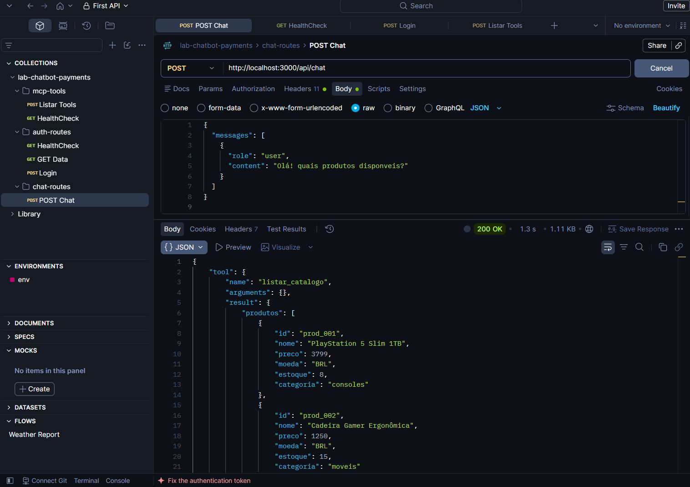

# Backend API (`backend`)

API responsável pela autenticação de usuários, controle de saldos/limites em memória e orquestração entre o cliente MCP e o modelo LLM local (Ollama).

- **Porta:** `3000`
- **Healthcheck:** `GET /health`
- **Autenticação:** `POST /api/auth/login`
- **Chat (NDJSON Stream):** `POST /api/chat`

## Variáveis de Ambiente (`.env`)

Crie o arquivo `.env` baseado no `.env.example`:

| Variável | Valor Padrão | Descrição |
|---|---|---|
| `PORT` | `3000` | Porta da API |
| `MCP_URL` | `http://localhost:3001/mcp` | URL do servidor MCP |
| `OLLAMA_URL` | `http://localhost:11434` | URL do Ollama |
| `OLLAMA_MODEL` | `qwen3:1.7b` | Modelo LLM local |
| `JWT_SECRET` | `super_secret_jwt_key_payments_2026` | Segredo para tokens JWT |
| `JWT_EXPIRES_IN` | `1h` | Tempo de expiração do JWT |

## Usuários de Teste

| Usuário | Senha | Nome | Limite Inicial |
|---|---|---|---|
| `cliente_vip` | `123` | Maria Alyce | R$ 15.000,00 |
| `cliente_padrao` | `123` | Pedro Leale | R$ 2.000,00 |
| `cliente_sem_saldo` | `123` | Gabriel Missio | R$ 100,00 |

## Como Rodar e Testar

```bash
# Instalar dependências
npm install

# Rodar testes de autenticação
npm run test:auth

# Iniciar servidor em modo dev
npm run dev
```

## Endpoints Principais

### Login (`POST /api/auth/login`)
- **Body:**
```json
{
  "username": "cliente_padrao",
  "password": "123"
}
```
- **Resposta (200 OK):**
```json
{
  "token": "eyJhbGci...",
  "user": { "id": "usr_std_02", "name": "João Souza", "limite_disponivel": 2000 },
  "expiresIn": "1h"
}
```

### Chat Stream (`POST /api/chat`)
- **Header:** `Authorization: Bearer <token>`
- **Body:**
```json
{
  "messages": [{ "role": "user", "content": "Quais produtos vocês têm?" }]
}
```
- **Resposta (`application/x-ndjson`):**
```ndjson
{"tool":{"name":"listar_catalogo","arguments":{},"result":{...}}}
{"message":{"role":"assistant","content":"Temos..."}}
{"done":true}
```

## Evidências no Postman

1. **Healthcheck (`GET /health`)**
   

2. **Login de Usuário (`POST /api/auth/login`)**
   

3. **Perfil do Usuário (`GET /api/user/me`)**
   

4. **Chat Stream (`POST /api/chat`)**
   
