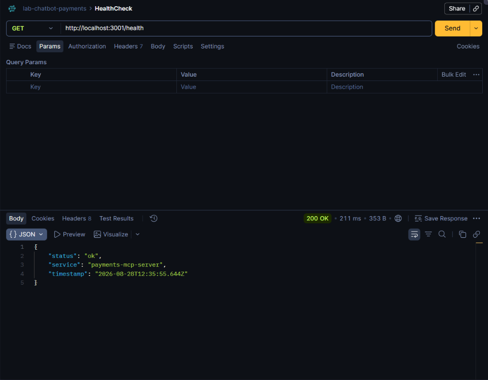
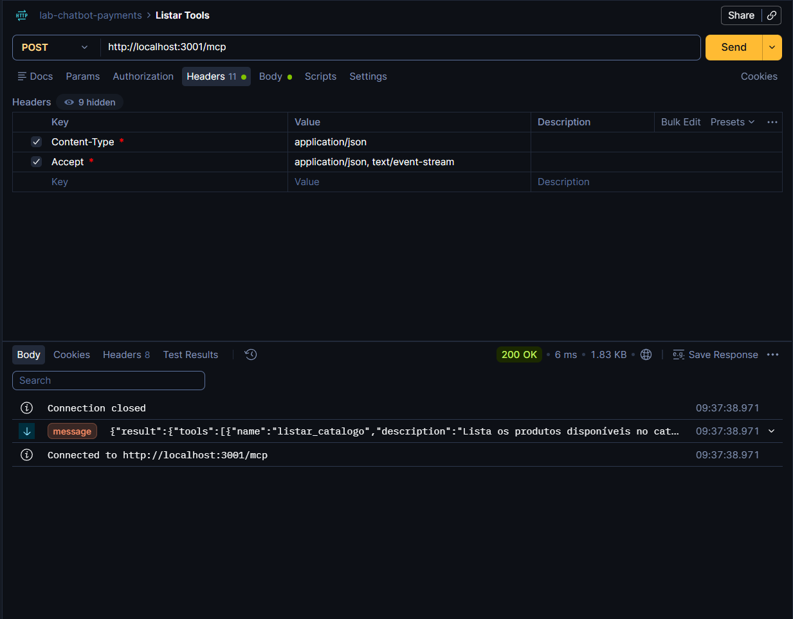

# Servidor MCP de Pagamentos (mcp-tools)

## 1. Visao Geral
Modulo responsavel pelo Servidor Model Context Protocol (MCP) que expoem de forma desacoplada e deterministica as ferramentas de consulta de catalogo, reserva de intencao de compra e liquidacao financeira.

- **Porta padrao:** `3001`
- **Endpoint principal:** `POST http://localhost:3001/mcp`
- **Endpoint healthcheck:** `GET http://localhost:3001/health`
- **Transporte:** `StreamableHTTPServerTransport` (Stateless)
- **Responsavel:** Álvaro Kayc

---

## 2. Requisitos Cumpridos

### 2.1 Ferramentas MCP Implementadas
1. **`listar_catalogo`**
   - Lista produtos disponiveis com precos em BRL e controle de estoque.
   - Suporta parametro opcional `categoria` para filtragem.
2. **`registrar_intencao`**
   - Registra reserva de compra com `produto_id` e `quantidade`.
   - Gera identificador unico (`int_xxxxxxxx`) e calcula o `valor_total` deterministicamente no backend.
   - Define prazo de validade em ISO 8601 configuravel via variavel de ambiente.
3. **`realizar_compra`**
   - Efetiva o pagamento atraves de `intencao_id` e `metodo_pagamento` (`cartao` ou `pix`).
   - Valida e bloqueia:
     - Intencao inexistente ou de outro usuario (`INTENCAO_INVALIDA`).
     - Pagamento duplicado (`INTENCAO_JA_PAGA`).
     - Intencao com prazo vencido (`INTENCAO_EXPIRADA`).
     - Valor acima do limite do usuario (`LIMITE_EXCEDIDO`).
     - Metodos nao suportados (`METODO_INVALIDO`).
   - Realiza debito atomico do saldo e baixa no estoque em caso de aprovacao.

### 2.2 Base de Dados em Memoria (`src/db/`)
- `catalog.ts`: catalogo inicial de produtos e controle de estoque.
- `users.ts`: perfis de teste (`cliente_vip`, `cliente_padrao`, `cliente_sem_saldo`) com saldos e limites dedicados.
- `intents.ts`: store de intencoes e maquina de estados (`pendente`, `paga`, `expirada`).

---

## 3. Execucao e Testes

### 3.1 Instalacao e Inicializacao
```bash
# Instalar dependencias
npm install

# Executar suite de testes unitarios
npm run test:tools

# Iniciar o servidor MCP em modo watch
npm run dev
```

### 3.2 Validacao via Postman

#### Requisicao 1: Healthcheck (`GET /health`)
- **Metodo:** `GET`
- **URL:** `http://localhost:3001/health`
- **Resposta Esperada (200 OK):**
```json
{
  "status": "ok",
  "service": "payments-mcp-server",
  "timestamp": "2026-08-28T12:35:55.644Z"
}
```

#### Requisicao 2: Descoberta de Ferramentas (`tools/list`)
- **Metodo:** `POST`
- **URL:** `http://localhost:3001/mcp`
- **Headers:**
  - `Content-Type: application/json`
  - `Accept: application/json, text/event-stream`
- **Body:**
```json
{
  "jsonrpc": "2.0",
  "id": 1,
  "method": "tools/list",
  "params": {}
}
```

---

## 4. Evidencias de Testes

### 4.1 Testes Unitarios Locais
Resultado da execucao via `npm run test:tools`:
```text
[OK] listar_catalogo
[OK] registrar_intencao
[OK] realizar_compra (PIX)
[OK] realizar_compra (Cartao)
[OK] Erro INTENCAO_JA_PAGA
[OK] Erro INTENCAO_INVALIDA
[OK] Erro LIMITE_EXCEDIDO

Todos os testes passaram com sucesso.
```

### 4.2 Testes no Postman
1. **HealthCheck (`GET /health`)**: Servidor respondendo 200 OK com status ativo.
   
2. **Tools Discovery (`tools/list`)**: Listagem e schemas das 3 ferramentas registradas.
   
